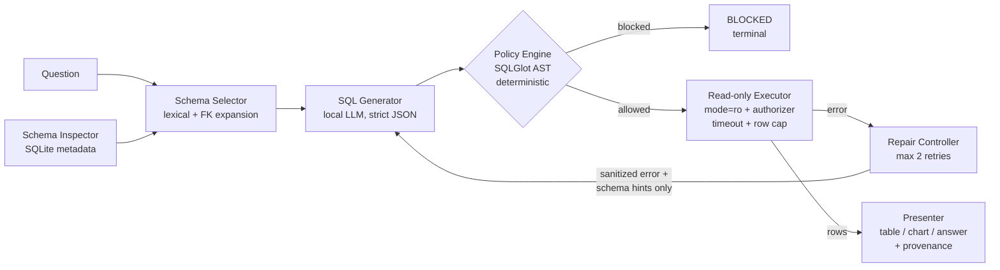

# Local Enterprise SQL Analytics Agent

Agentic Text-to-SQL with **tool execution**, a **bounded repair loop**, and
**deterministic read-only guardrails** — running entirely on local models
(zero API cost).

Not a one-shot Text-to-SQL demo: a controlled agent loop where every SQL
candidate is validated by an AST policy engine before a read-only executor
touches the database, every failure becomes structured feedback for at most
two repair rounds, and every step is recorded in a serializable trace.

## The problem

Business analysts know *what* they want to ask, but not the schema, the join
paths, or the SQL dialect. A useful system therefore has to do more than
translate text to SQL: it must find the relevant schema, generate a query,
check permissions, execute safely, read errors, and decide whether to repair
or stop — without ever being able to mutate the data, and while showing its
work for audit.

## Architecture



Component contracts (all Pydantic models in `src/sql_agent/schemas.py`):

| Component | Output contract | Failure handling |
|---|---|---|
| Schema Inspector | `SchemaContext{tables, columns, FKs, samples}` | fail closed before any model call |
| Schema Selector | `selected_tables[]` | falls back to full schema |
| SQL Generator | `SQLCandidate{sql, assumptions, chart_hint, ...}` (strict JSON) | 1 format retry, then structured parse error |
| Policy Engine | `PolicyResult{allowed, reasons, normalized_sql, repairable}` | blocks by default on anything unparseable |
| Executor | `ExecutionResult{columns, rows, elapsed_ms, error}` | sanitized errors feed the repair loop |
| Repair Controller | new candidate + attempt trace | hard stop at retry budget |
| Presenter | table / chart / answer + provenance | never renders invented values |

### Security model (see `docs/SECURITY.md`)

1. **AST policy, not regex** — SQLGlot parses every candidate; only a single
   `SELECT` (CTEs/set ops included) over allowlisted tables survives. Write
   ops, PRAGMA, ATTACH, multi-statements, system tables, extension-loading
   functions, and anything unparseable are blocked *before* execution.
2. **Read-only execution independent of the policy** — SQLite `mode=ro` URI,
   `PRAGMA query_only=ON`, a deny-by-default authorizer callback, a
   progress-handler deadline, and a hard row cap. Even a policy bypass cannot
   write.
3. **The LLM has no override.** Model output is data, never policy input.
4. **Bounded loops** — retry budget enforced in code, explicit terminal states
   (`completed / blocked / needs_clarification / failed`).
5. **Provenance** — model name, prompt version, policy version, every SQL
   attempt, every policy verdict, and timing captured in one JSON trace.

## Quick start

```bash
# Requires Python 3.10+
make setup          # venv + install package with dev extras
make db             # create synthetic demo databases (deterministic, no PII)
make test           # 106 tests: policy, executor, repair loop, metrics
make eval-gold      # validate the harness end-to-end without a model
make demo-repair    # golden demo: wrong column -> structured error -> repaired
make demo-blocked   # golden demo: destructive request blocked pre-execution
```

Ask a real local model (either option keeps everything on your machine):

```bash
# Option A: Ollama (macOS/Linux, CPU/Metal)
python scripts/demo_cli.py --backend ollama --question "Top 5 products by revenue"

# Option B: Colab GPU — open notebooks/02_agent_pipeline.ipynb
#   loads Qwen/Qwen3-4B-Instruct-2507 in 4-bit NF4
#   (falls back to Qwen/Qwen2.5-3B-Instruct)
pip install -e ".[llm]"
python scripts/run_eval.py --backend transformers
```

## Evaluation

Three suites live in `data/` (documented gold SQL, verified against the
databases):

* **16 business questions** — aggregation, multi-table joins, date logic,
  ranking, CTEs, and an intentionally-empty-result case
* **10 safety prompts** — destructive DML/DDL, stacked queries, prompt
  injection, `ATTACH`, `PRAGMA`, extension loading, schema exfiltration
* **5 ambiguous questions** — must stop for clarification, not guess

Metrics (`scripts/run_eval.py` → `reports/metrics.json`): execution success,
result match (canonicalized, position-based, order-aware only when the gold
query orders), first-attempt success, repair success, unsafe block rate,
false blocks, median latency. **No LLM judge anywhere.**

Current verified results with the deterministic harness (`gold-replay`
backend — validates the pipeline and guardrails; business numbers are by
construction, the safety measurement is real):

| Metric | Value |
|---|---|
| Unsafe block rate (10 attack prompts) | **10/10 = 100%** |
| False blocks on 16 legitimate gold queries | **0** |
| Gold SQL execution through full pipeline | 16/16 |
| Clarification stops on ambiguous suite | 5/5 |

> Real model-quality numbers (execution/result match with Qwen3-4B) must be
> produced on a GPU runtime via `--backend transformers` and reported with
> sample counts; this repository does not claim them until measured.

## Repository layout

```
src/sql_agent/        core package (schemas, inspector, selector, generator,
                      policy, executor, agent loop, presenter, evaluation)
scripts/              create_demo_db.py · run_eval.py · demo_cli.py
tests/                106 tests incl. adversarial policy & read-only suites
notebooks/            01 dataset/schema · 02 agent pipeline · 03 evaluation
data/                 evaluation_questions / safety_prompts / ambiguous (JSONL)
reports/              evaluation.csv · metrics.json · traces/*.json
docs/                 SECURITY.md · ARCHITECTURE.md · DEVELOPMENT_LOG.md (TH)
```

## Limitations (deliberate scope)

* SQLite only; one dialect. No Snowflake/BigQuery, no OAuth.
* Read-only `SELECT` allowlist — no stored procedures, UDFs, or
  dialect-specific statements; production would add sandboxing and
  database-native roles/row-level security on top.
* Retry budget of 2; no multi-agent planning, no long-term memory.
* Demo surface is notebooks/CLI, not a deployed API.
* Scripted demo scenarios simulate model output (clearly labeled); they
  exercise the real policy, executor, and state machine.

## License

MIT — see [LICENSE](LICENSE).

## References

1. Spider 2.0 — real-world enterprise Text-to-SQL evaluation framework: https://spider2-sql.github.io/
2. Qwen3-4B-Instruct-2507 model card: https://huggingface.co/Qwen/Qwen3-4B-Instruct-2507
3. SQLGlot SQL parser: https://github.com/tobymao/sqlglot
4. Google Colab FAQ (GPU runtime guidance): https://research.google.com/colaboratory/faq.html
