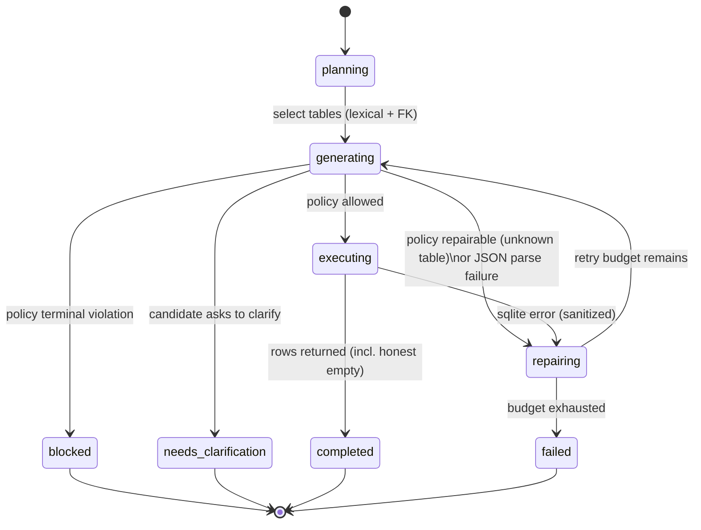

# Architecture

## State machine

`AgentState` (Pydantic) captures the whole run: question, selected tables,
every `SQLAttempt` (raw response, candidate, policy verdict, execution result,
feedback), terminal status, stop reason, and provenance (model, prompt
version, policy version, timing). One run serializes to one JSON trace in
`reports/traces/`.

## Module map

| Module | Responsibility | Key decision |
|---|---|---|
| `schemas.py` | every cross-component contract | single place where contracts change |
| `schema_inspector.py` | SQLite → `SchemaContext` | read-only URI; samples truncated; fail closed if unreadable |
| `schema_selector.py` | question → relevant tables | non-LLM lexical scoring + Thai/English synonyms + FK expansion; small DBs skip selection |
| `llm.py` | backend abstraction | `ScriptedBackend` (tests/demos), `TransformersBackend` (Colab GPU, 4-bit), `OllamaBackend` (localhost only) |
| `sql_generator.py` | prompts + strict JSON parsing | model output is validated, never repaired into SQL; 1 format retry |
| `sql_policy.py` | AST allowlist verdict | terminal vs repairable violations; LIMIT normalization; fail closed |
| `executor.py` | read-only execution | authorizer + deadline + row cap, independent of policy |
| `agent.py` | the state machine above | retry budget in code; feedback = error + schema names only |
| `presenter.py` | table/chart/answer/trace | charts only from executed columns; honest empty-result answer |
| `evaluation.py` | canonicalization, comparison, metrics | position-based compare; order-aware only when gold orders; no LLM judge |

## Design decisions worth defending in review

1. **Framework-free loop** (~150 lines) instead of LangChain/LangGraph: the
   point of the project is to show the control flow; nodes can be ported into
   a framework later without changing contracts.
2. **Unknown column ≠ policy block.** The executor is read-only, so a wrong
   column is harmless and produces exactly the structured error the repair
   loop needs. Blocking it would hide the repair capability entirely.
3. **Unknown table = repairable block.** It never reaches the executor (the
   allowlist is authoritative), but the model deserves one structured chance
   to fix a hallucinated name.
4. **Policy checks against the full schema, not the prompt subset** — a real
   table outside the selector's subset is legitimate, not a hallucination.
5. **Gold-replay backend** in the eval harness: proves the harness, executor,
   and safety measurement without any model — and keeps model-quality claims
   honest by construction.
6. **`src/` package layout** (vs loose files): `pip install -e .` makes the
   same code importable from notebooks, tests, and scripts — the POC-to-
   service story the blueprint asks for.
